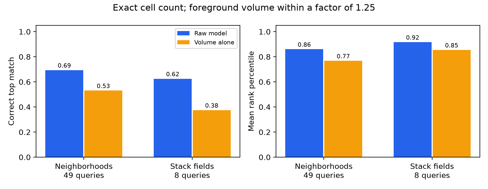

# 3D organoid cell shape from raw microscopy

A personal research project combining Cellpose-SAM v2, u-Segment3D, conventional 3D morphometry, and compact 3D representation models. It analyzes **108 image stacks and 1,088 predicted cells** from the Mouse-Organoid-Cells-CBG example dataset. The main experiment asks whether a raw-image encoder retrieves similar multicell 3D arrangements after candidate cell count and volume are matched.

**[Read the experiment report](docs/REPORT.md)** · [Reproduce the pipeline](docs/REPRODUCIBILITY.md) · [Data and artifact policy](docs/DATA.md)

The matched retrieval audit found a correct raw-model top match in **34/49** neighborhood queries versus **26/49** for a volume-only baseline. The paired stack-level sign-flip result was **p=0.116**, and test fields were often highly similar to training fields (median nearest-training full-image correlation **0.925**). These results are exploratory within this dataset; they do not establish generalization to independent biological organoids.

## Repository layout

- `docs/REPORT.md`: findings, methods, interpretation, limitations, and references.
- `docs/figures/`, `docs/tables/`: small analytical publication artifacts.
- `scripts/`: reconstruction, analysis, model preparation/training, evaluation, audits, and figure generation.
- `config/`: exact run settings and the u-Segment3D dependency patch.
- `tests/`: focused pipeline tests.
- `requirements-lock.txt`: recorded packages for the original macOS ARM64 environment.

Raw TIFFs, masks, large results, trained weights, and the upstream u-Segment3D checkout are excluded. To use your own downloaded dataset, point `ORGANOID_DATA_DIR` at its `train` folder; see [reproduction instructions](docs/REPRODUCIBILITY.md).

This is a computational exploration, not a biological subtype classifier. The physical voxel spacing is inferred rather than TIFF-verified, and biological specimen identities are unavailable. The report keeps those constraints alongside every main conclusion.
