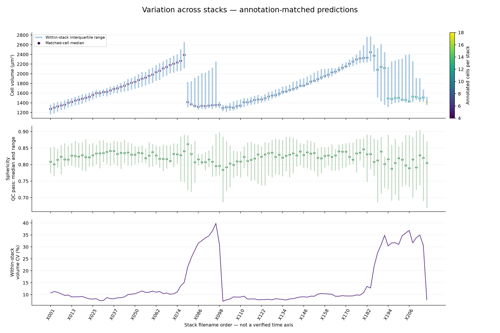
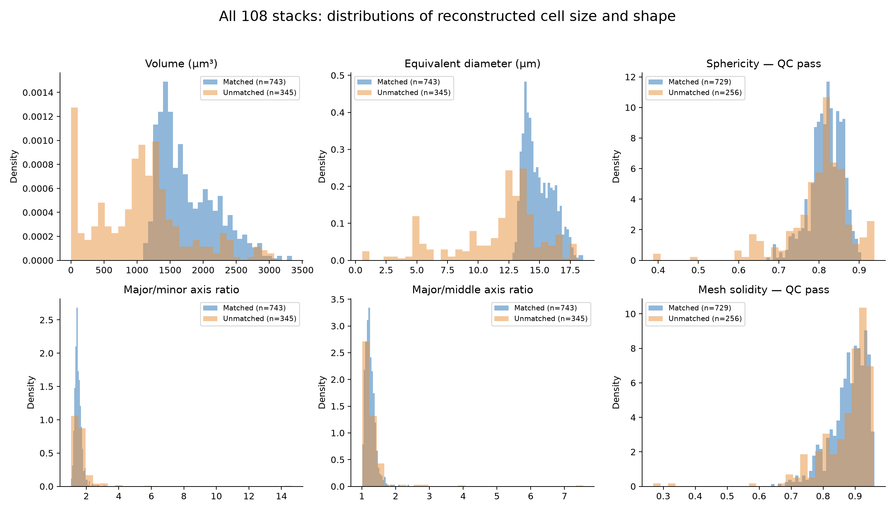
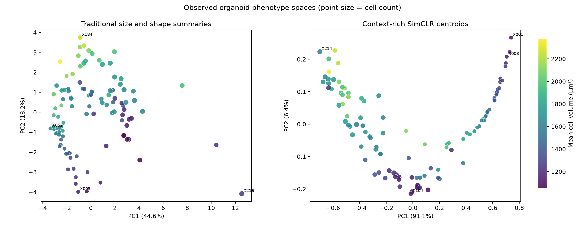
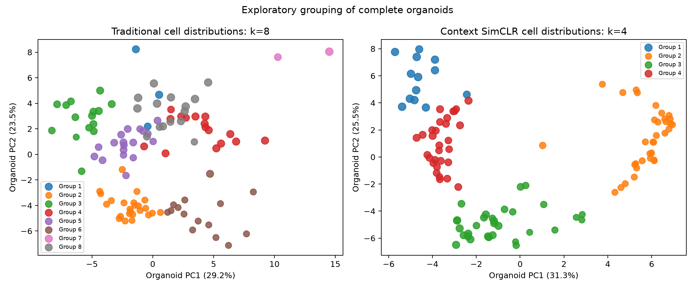
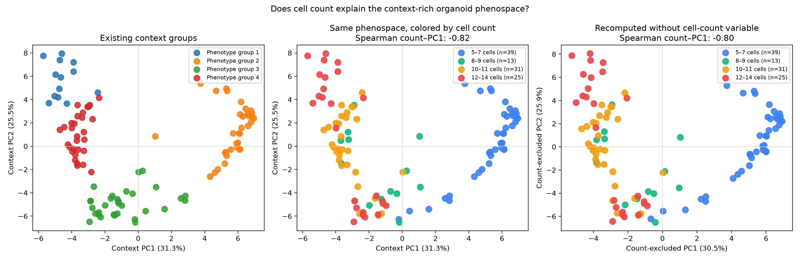
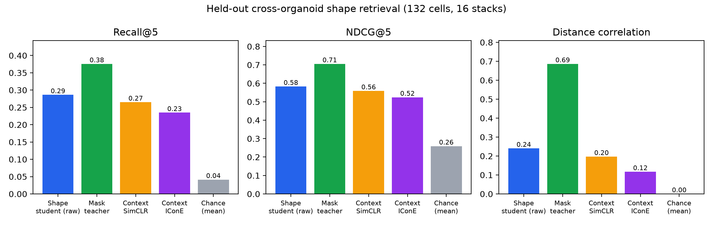
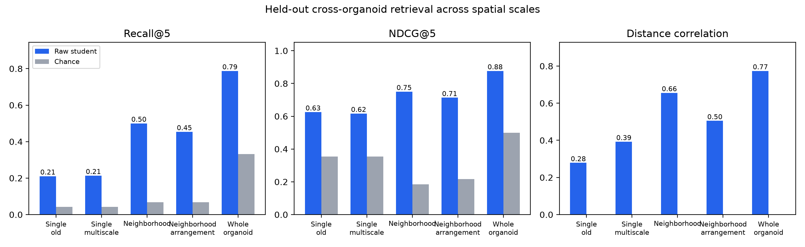

# Reconstructing and comparing 3D organoid cell morphology from microscopy

**Project report · 22 September 2026**

This project asks how much three-dimensional cell and multicell shape information can be recovered from raw organoid microscopy by a compact representation model. We reconstructed cells in 108 image stacks with Cellpose-SAM v2 (`cpsam_v2`) and u-Segment3D, measured conventional 3D morphology, trained several 3D contrastive encoders, and finally evaluated retrieval of cell arrangements under count and volume matching. The strongest defensible conclusion is **within-dataset evidence that a shape-specialized raw-image encoder captures some 3D arrangement information beyond total foreground volume**. Evidence for transfer to independent biological organoids is still missing.

## Data, units, and experimental roles

The source is the public [Mouse-Organoid-Cells-CBG example dataset](https://github.com/juglab/EmbedSeg/releases/tag/v0.1.0) used by [EmbedSeg](https://arxiv.org/abs/2101.10033). It contains 108 `X###.tif` image stacks with paired `Y###.tif` instance annotations in the training set. In the reconstruction stage, the existing annotations were **comparison data only**: Cellpose and u-Segment3D saw the raw images, and reference masks were loaded after prediction. Later binary-mask SimCLR and mask-teacher experiments used *predicted* masks. Thus the shape-specialized student is segmentation-assisted during its training and evaluation, even though its inference input is raw intensity.

The assumed source voxel spacing is **Z/Y/X = 1.0/0.1733/0.1733 µm**, inferred from the dataset publication and [upstream organoid tutorial](https://github.com/DanuserLab/u-segment3D/blob/33974282e436d456f4941a2c2b9a8c2d1d9ed2fb/tutorials/tissue/segment_organoid_3D.py), not confirmed by TIFF metadata. Absolute volumes, surfaces, and fixed-size crops inherit that assumption. We use “stack” when describing a `X###` field: some fields show spatially separated cell clusters, and specimen identity, imaging session, animal, and time point metadata were unavailable. A stack is therefore not proven to be one independent biological organoid.

## Reconstruction and conventional morphology

The raw stack was rescaled to an approximately isotropic working grid, background-corrected, and passed through Cellpose-SAM v2 in XY, XZ, and YZ views. u-Segment3D aggregated the orthoview probabilities and flows into 3D instances. Production reconstruction used the configuration in [`config/first5-cpsam-v2.json`](../config/first5-cpsam-v2.json). The same model/settings were used for the remaining stacks. Annotation matching at IoU ≥ 0.5 yielded **743 matched predicted objects out of 750 reference cells**. Across all 108 stacks, there were **1,088 predicted objects**; 985 passed a conservative shape-quality screen. Object precision against the supplied annotations was 68.4%, recall 99.1%, F1 0.809, and mean per-stack foreground Dice 0.825. Unmatched predictions may include real unannotated structures as well as segmentation errors.

Among the **743 annotation-matched cells**, median volume was **1,634 µm³** (middle half 1,413–2,067 µm³), and median equivalent-sphere diameter was 14.61 µm. On the **729 matched cells passing the surface-shape screen**, median sphericity was **0.82** (middle half 0.80–0.85). The matched-cell volume range was 1,094–3,342 µm³. Stack-mean matched volume ranged from approximately 1,251 to 2,495 µm³; its coefficient of variation across stacks was 17.0%, while the median within-stack volume CV was 10.0%. These are descriptive reconstructed-object statistics; annotation bias, shared image provenance, and segmentation uncertainty limit biological interpretation. Matched predicted volumes exceeded the paired reference volumes by a median 8.8%.

To reduce voxel stair-stepping in visualization, a 100-pass Taubin smoother (λ=0.5, ν=0.53) was applied to exported meshes. It produced smoothed exports for 1,083 of 1,088 objects; five tiny or distorted cases retained their originals under a volume/area safeguard. Median surface-area change was −7.80% and median enclosed-volume change was +0.397% among usable watertight meshes. **Smoothing did not change the label TIFFs or the CNN training inputs and cannot add optical resolution.** Surface-based measurements must be compared only within the same measurement procedure.

## Cell-level representations

We compared a conventional feature vector (volume, surface and axis-based shape measurements) with learned 3D embeddings:

| Representation | Network input | Training signal | Key interpretation |
|---|---|---|---|
| Binary-mask SimCLR | Predicted cell mask, cropped, isotropically resampled, cubic 64³ field | Two independently augmented views of the same instance | Strong access to segmented geometry; scale partly normalized |
| Context-rich raw SimCLR | Unmasked 40 µm raw-intensity crop, centered using a predicted mask | Same contrastive-view principle | Includes neighboring cells, background, and imaging context |
| Isolated raw SimCLR | Raw intensity inside the predicted cell; outside zeroed | Contrastive views | Mask boundary remains indirectly visible |
| Isolated/context-rich raw IConE | Corresponding raw crops | Instance-anchor contrastive objective | Controlled alternative to SimCLR, not an exact reproduction of the paper |
| Shape-specialized raw student | Raw crop or multicell raw field | SimCLR-style contrast, alignment with a predicted-mask teacher, and auxiliary shape probe | Hybrid weakly shape-supervised training, **not pure self-supervision** |

The initial binary network used a small 3D residual encoder with 128-dimensional embeddings. The raw experiments reused the compact encoder family and whole-stack diagnostic splits. Frozen ridge probes were fitted only on training cells, with regularization selected by training-stack folds. For isolated raw intensity, sphericity prediction on 267 diagnostic validation cells reached R² **0.511** versus **0.744** for binary-mask embeddings; the untrained isolated CNN reached **0.187**, showing both a learned signal and a boundary cue supplied by zeroing outside the mask. Context-rich raw SimCLR was worse for this *individual-cell morphology* probe (sphericity R² **−0.435**) but gave the strongest observed *stack-specific split-half signature* below. A negative R² means worse than predicting the validation mean. The same validation stacks were used for checkpoint selection, so these are diagnostic rather than untouched-test numbers.

The IConE runs did not overturn that practical result. Isolated-raw IConE reached sphericity R² **0.437** under a matched 50-epoch comparison. Context-rich IConE gave **0.5%** top-1 split-half stack retrieval, below context-rich SimCLR's **4.4%** in the same analysis. The IConE implementation used this project's encoder, augmentations and budget; a full architecture/compute reproduction remains open.

## Comparing whole fields through their cells

An organoid-level representation should retain both typical cells and within-field heterogeneity. For exploration, we summarized every quality-passing cell in each of 108 stacks using means, spread, and 10/25/50/75/90% quantiles. The conventional 3D-feature representation produced its highest tested silhouette at **k=8, 0.311**, including groups of only two and three stacks. The context-rich SimCLR representation produced **k=4, 0.375** with group sizes 13/34/31/30. Agreement between the partitions was moderate (adjusted Rand index **0.403**). K-means always partitions data; neither solution establishes discrete biological subtypes.

The U-shaped context-rich phenospace has a strong **cell-count gradient**: count versus PC1 Spearman ρ = **−0.819**. Even after deleting the explicit count feature and recomputing PCA, the association persisted (ρ = **−0.799**). The representation therefore encodes count-correlated information via its cells and context; the U should not be read as a maturation trajectory or specific phenotype without metadata.

In a separate split-half diagnostic, cells in each stack were divided into two random groups and one group's representation tried to retrieve the other among 108 stacks. Context-rich SimCLR centroid top-1 was **4.4%**, conventional cell-feature centroid **1.9%**, chance **0.9%**, over 200 random partitions. This measures reproducibility of a stack signature; it does not prove biological phenotype specificity. More expressive distribution distances and quantile profiles were mostly too noisy with only about 2–7 cells per half. We therefore retain complete per-cell records plus count, robust feature quantiles and the context-rich centroid, rather than reducing every field to only a mean.

## Raw-image models directed toward 3D shape

A predicted-mask **teacher** was trained on binary single-cell shapes; a raw-image **student** combined contrastive learning, teacher alignment, and an auxiliary shape objective. In the 16-stack, 132-cell nominal test set, it recovered **28.6%** of each query's five nearest morphology-defined cells in its top five, versus **26.5%** for context-rich SimCLR, **23.5%** for context-rich IConE, **37.6%** for the mask teacher, and **4.1%** chance. Corresponding shape-distance Spearman correlations were **0.240**, **0.197**, **0.117**, and **0.686**. The student led the older raw encoders numerically, but its margin over context-rich SimCLR is small and was not tested across repeated seeds or independent specimens. Here “shape” means agreement with eight standardized measurements derived from predicted masks.

We then added predicted single-cell, multi-cell neighborhood, and complete-stack mask fields to teacher training (984/578/108 examples respectively; **1,670 total**) and fine-tuned the raw student. Unmatched internal retrieval scores suggested strong multi-cell performance, but count, occupancy, and field size remained powerful cues. For example, the 16 nominal test whole-field queries gave Recall@5 **0.788**, with only **0.332** chance under that candidate setup. That score is *not* clean evidence of detailed 3D shape retrieval because the candidates are not matched on those cues.

The more informative audit fixed the candidate **cell count exactly**, required **total foreground volume within 80–125%** of the query, and restricted matches to different image stacks. Its target was the sorted vector of pairwise **cell-centroid distances normalized by their RMS**. This measures 3D arrangement, not cell-surface shape or contact topology. The simple baseline ranked the same eligible candidates by residual total-volume difference. A mask-integrity check found voxel IoU = 1.0 between the reconstructed evaluation masks and the saved model masks.

| Field and eligible queries | Raw student, correct top match | Volume-only baseline | Difference |
|---|---:|---:|---:|
| 49 local neighborhoods from 15 query stacks | **34/49 = 69.4%** | 26/49 = 53.1% | +16.3 percentage points |
| 8 six-cell whole-stack fields | **5/8 = 62.5%** | 3/8 = 37.5% | +25.0 points |

For neighborhoods, a paired sign-flip test clustered by query stack gave **p=0.116** for the top-match gain: suggestive, not decisive. The whole-field subset is especially small and covers only six-cell fields. Candidate sets are also small (median four neighborhoods and seven whole fields). The complete per-method summary and inference are in [`matched_3d_retrieval.csv`](tables/matched_3d_retrieval.csv) and [`matched_3d_inference.json`](tables/matched_3d_inference.json).

## Critical split audit and conclusions

Although test stack identifiers were held out, pixel-aligned downsampled full-image comparisons found that a test stack's nearest training stack had **median Pearson correlation 0.925**; **13 of 16** test stacks exceeded 0.9. This does not prove identical biological specimens, but it strongly weakens any claim of independent-organoid generalization. One field may also contain multiple separated cell clusters. No animal, specimen, treatment or acquisition grouping was available to correct the split. The [split audit](tables/split_similarity.json) is part of the results, not a post hoc footnote.

These experiments establish a working 3D reconstruction and analysis pipeline, a clear count-correlated context-rich phenospace, and a promising *internal* raw-image arrangement retrieval signal beyond a volume-only comparator. They **do not yet establish independent biological phenotype groups, pure self-supervised shape discovery, or transfer to unseen organoids**. The next decisive experiment is to obtain biological/acquisition identifiers, form group-disjoint train/validation/test splits (or conservative image-similarity groups as a proxy), retrain all encoders with the same budget, and repeat count/volume-matched retrieval alongside surface-shape and contact-topology targets. More independent organoids and verified voxel calibration are needed before biological claims.

## Reproducibility and provenance

Code, exact configurations, run order, and artifact policy are described in [`REPRODUCIBILITY.md`](REPRODUCIBILITY.md). The compact publication figures and tables can be regenerated from private `results/` using `python scripts/build_publication_assets.py`. Full source TIFFs, supplied masks, predictions, per-cell crops, learned embeddings, checkpoints, and rendered 3D cases are intentionally outside this GitHub package; see [`DATA.md`](DATA.md). All quantitative values above were transcribed from completed local run reports and curated summary files, and this publication build does not rerun model training.

Method references: [u-Segment3D](https://github.com/DanuserLab/u-segment3D), [Cellpose](https://github.com/MouseLand/cellpose), [SimCLR](https://arxiv.org/abs/2002.05709), and the [IConE preprint](https://arxiv.org/abs/2603.15263).
